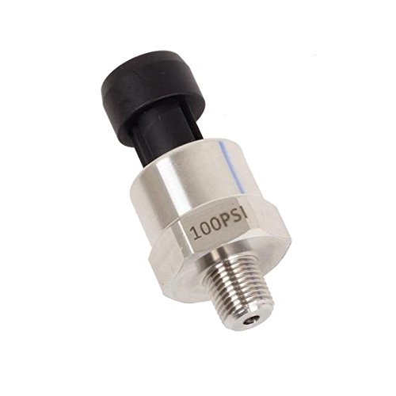
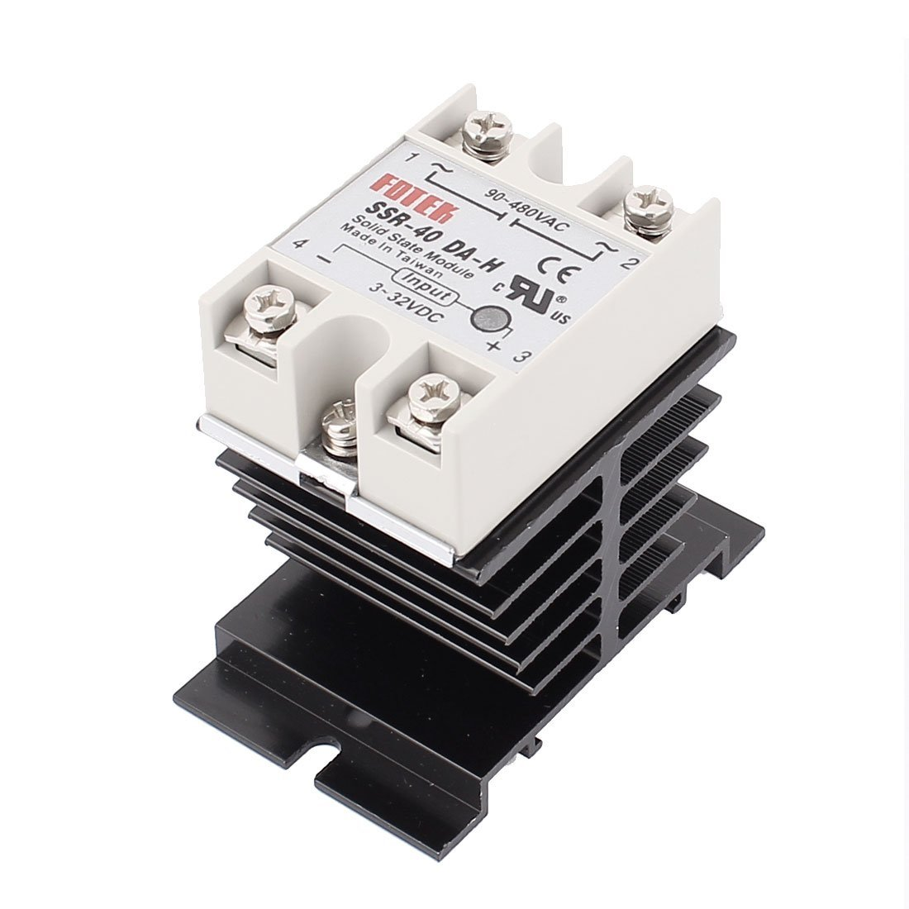

# Pool Automation Project

Project created to automate sheduled runtimes for the pump and sweeper and replace the old mechanical timer.  The front-end is written in Python and the web-server is running on port 8000.  Included in the code:

  1.  Reads the Max temperature of the day to calculate the runtime schedule.
  2.  Reads the starting pressure 10 secs after the pump starts and continues to monitor the pressure until the pump is turned off.  If the pressure rises 10 lbs more than the starting pressure, the pump is turned off and a message is logged by python.
  3.  Scheduler that is configurable via the web-frontend.
  4.  Weather Forecast for the latitude/longitude set in pool.py.  Pulling data from http://forecast.weather.gov/MapClick.php?lat="+lat+"&lon="+lon+"&FcstType=json
  5.  Buttons to manually operate the Pump (two-speed), Sweeper, and Blower for Jacuzzi.

      GPIO Pin 8 - Pump
      
      GPIO Pin 9 - Low-Speed
      
      GPIO Pin 10 - High Speed
      
      GPIO Pin 11 - Sweeper
      
      GPIO Pin 12 - Blower

## Hardware Used

Raspberry pi 2/3
# 

Arduino Variant (MEGA2560 was used for this project)
# 

Autex Pressure transducer/sender/sensor 100 psi stainless steel for oil, fuel, air, water
# 

SSR-40DA-H DC-AC 40A Solid State Relay 3-32VDC/90-480VAC + Heat Sink
# 

## Python Modules Needed

  APScheduler (3.2.0)
  
  arduino-python (0.2)
  
  CherryPy (8.1.2)
  
  Flask (0.10.1)
  
  gevent (1.1.2)
  
  gevent-socketio (0.3.6)
  
  gevent-websocket (0.9.5)
  
  greenlet (0.4.10)

## Install
  
  Install Python Modules listed above with PIP
  
  git clone https://github.com/rlemm-juniper/swimming-pool-automation
  
  python pool.py
  
  -or-
  
  ./pool.py

